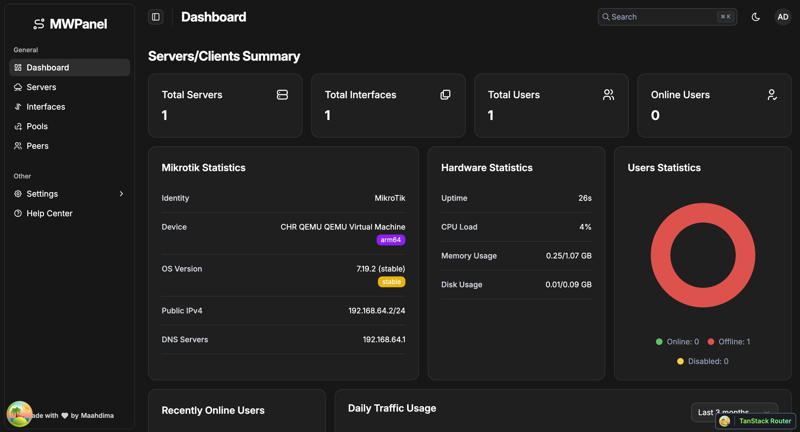
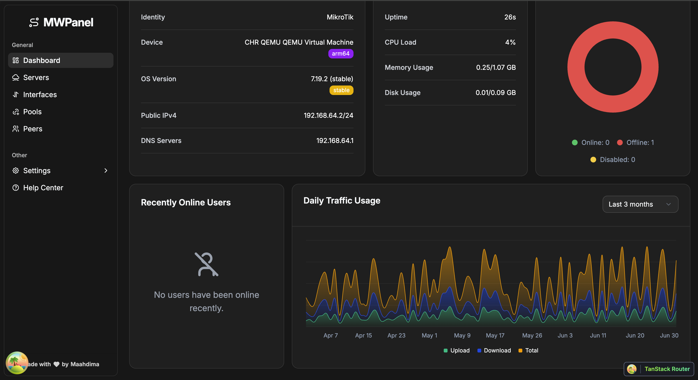
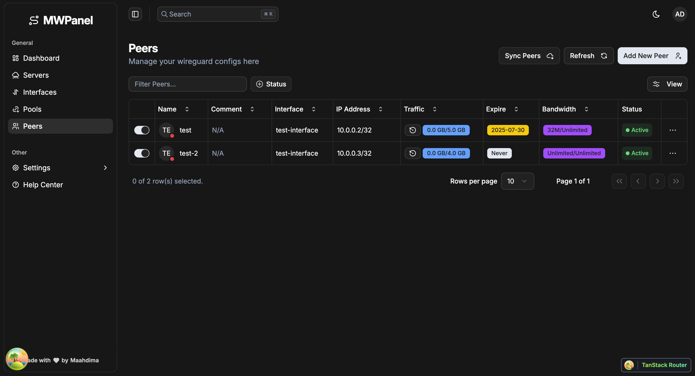
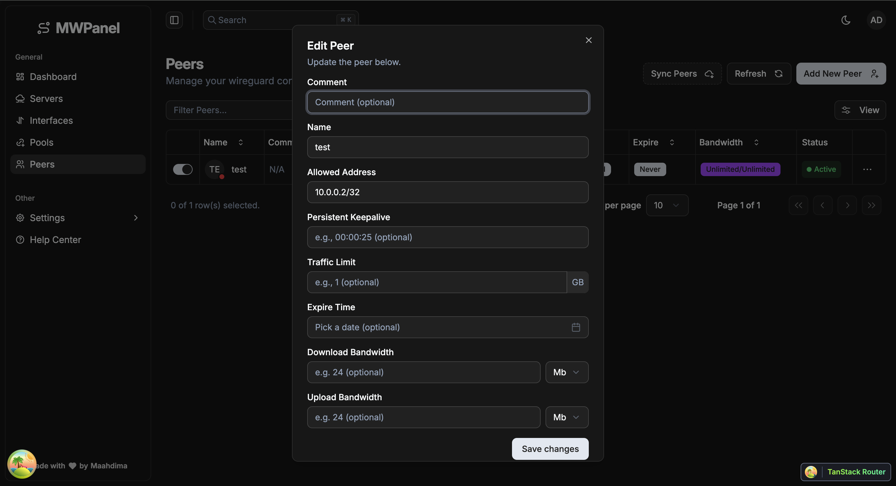
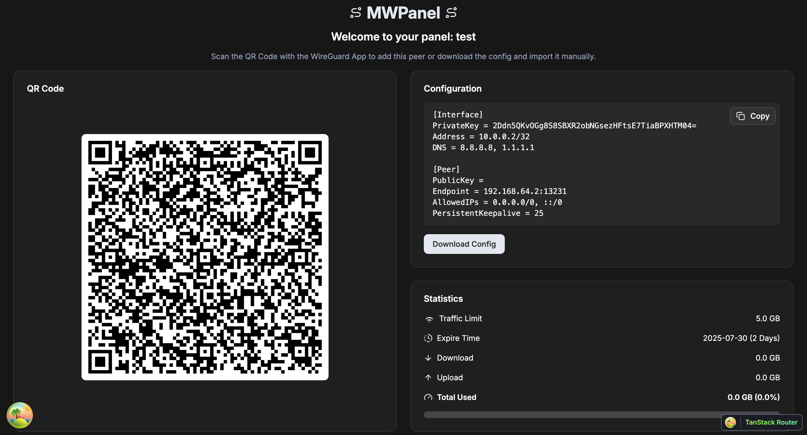

# MWP (Mikrotik WireGuard Panel)

A modern web panel for managing Mikrotik WireGuard VPN peers, built with **Go**, **React**, and **TypeScript**. Easily
create, update, share, and monitor WireGuard peers with a user-friendly interface and robust backend.

---

## Table of Contents

- [Features](#features)
- [Screenshots](#screenshots)
- [Getting-Started](#getting-started)
- [Build-From-Source](#build-from-source)
    - [Prerequisites](#prerequisites)
    - [Project Setup](#project-setup)
- [Configuration](#configuration)
- [Usage](#usage)
- [Roadmap](#roadmap)
- [Contributing](#contributing)
- [Contact](#contact)

---

## Features

- 🚀 Create, update, and delete WireGuard peers
- 🔒 Secure key generation and management
- 📊 Real-time peer status and usage statistics
- ⏱️ Automatic peer expiration time (TTL)
- 😉Traffic Limitations and auto-expiration
- 📉Bandwidth Limitation for upload and download
- 📤 Share peer configs via secure links and QR codes
- 🛠️ Mikrotik RouterOS API integration
- ↕️Multi-Server support (for future)
- 🔑 API token authentication
- 🖥️ Responsive React + Golang backend

---

## Getting Started

### Binary Releases

Download the latest binary release for your platform from
the [Releases](https://github.com/Maahdima/MWPanel/releases/latest)
page.

> [!TIP]  
> Default port for the web panel is `3000`.<br/>

> [!CAUTION]  
> Default username and password for the admin account is `mwpadmin` (Always change the default username and password to
> prevent hijacking).<br/>

> [!IMPORTANT]  
> The default username and password applies when the app runs for the first time, so you cant change it from the env
> anymore after initial run (Still can change them from the gui panel).<br/>

For Platform-specific instructions, see below.

#### Linux

Download the latest binary release, install it, and run it:

```bash
curl -fSLo mwp https://github.com/Maahdima/MWPanel/releases/latest/download/mwp.linux.$(uname -m)
sudo install -v -o root -g root -m 755 mwp /usr/local/bin/mwp
rm -f mwp
mwp
```

#### macOS

Download the latest binary release, install it, and run it:

```bash
curl -fSLo mwp https://github.com/Maahdima/MWPanel/releases/latest/download/mwp.darwin.$(uname -m)
sudo install -v -o root -g root -m 755 mwp /usr/local/bin/mwp
rm -f mwp
mwp
```

#### Windows

Download the latest binary release from [here](https://github.com/Maahdima/MWPanel/releases/latest) and run it by
**double-clicking the executable** or using PowerShell:

```powershell
.\mwp.windows.amd64.exe
```

### Docker

Run the following command to start MWP using Docker:

```bash
docker run -d \
  --name mwp \
  -p 3000:3000 \
  -v mwp-data:/var/www/mwp \
  -e ADMIN_USERNAME=mwpadmin \
  -e ADMIN_PASSWORD=mwpadmin \
  maahdima/mwp:latest
```

> **Note**<br/>
> If docker registry is not accessible, you can use the github image registry (https://ghcr.io):
> `https://ghcr.io/maahdima/mwp:latest`<br/>

### Docker Compose

Create a `docker-compose.yml` file with the following content:

```yaml
version: '3.8'
services:
  mwp:
    image: maahdima/mwp:latest
    ports:
      - 3000:3000
    environment:
      ADMIN_USERNAME: mwpadmin
      ADMIN_PASSWORD: mwpadmin
    volumes:
      - mwp-data:/var/www/mwp
```

Run the following command to start MWP using Docker Compose:

```bash
docker-compose up -d
```

## Build from Source

### Prerequisites

- **Go** 1.20 or later
- **Node.js** 18 or later
- **pnpm**
- Mikrotik RouterOS device with API access
- PostgreSQL or SQLite (depending on backend config)

---

### Project Setup

```bash
git clone https://github.com/maahdima/mwp.git
cd mwp

cp .env.example .env
# Edit .env with desired settings

go mod tidy
cd api
go run cmd/main.go

cd ui
pnpm install
pnpm run dev
```

---

Visit `http://localhost:3000` in your browser.

---

## Configuration

## Usage

1. **Login** using Mikrotik credentials
2. **Create a new peer** from the dashboard
3. **Share config** via QR code or secure link
4. **Monitor stats** such as last handshake, data usage
5. **Auto-expire** peers after defined TTL
6. **Revoke or edit** existing peers

---

## Configuration

MWP is configured using environment variables. Create a `.env` file in the root project directory (for Docker) or in the
`api` directory (for manual setup).

| Variable         | Description                                 | Default    | Required |
|------------------|---------------------------------------------|------------|----------|
| `SERVER_HOST`    | The ip address to listen on it.             | `0.0.0.0`  | No       |
| `SERVER_PORT`    | The port for the backend Go API server.     | `3000`     | No       |
| `ADMIN_USERNAME` | The username for the panel's admin account. | `mwpadmin` | No       |
| `ADMIN_PASSWORD` | The password for the panel's admin account. | `mwpadmin` | No       |

---

## Roadmap

- [x] Mikrotik WireGuard peer management
- [x] QR code + link sharing for peer configs
- [x] Automatic TTL + traffic expiration
- [x] Stats dashboard (last handshake, usage)
- [x] Mikrotik backup/sync mechanism
- [x] API token authentication
- [x] Theme customization (light/dark)
- [x] Docker support
- [x] Single Binary Build
- [ ] Telegram Bot support for notifications
- [ ] Multi-server support

---

## Screenshots

### Dashboard-1



### Dashboard-2



### Peers Page



### Craete Peer



### Share Peer


---

## Contributing

Contributions are welcome! 🎉

1. Fork the repo
2. Create a feature branch:
   ```bash
   git checkout -b feat/my-feature
   ```
3. Commit your changes:
   ```bash
   git commit -am "Add my feature"
   ```
4. Push to the branch:
   ```bash
   git push origin feat/my-feature
   ```
5. Open a pull request

> For major changes, please open an issue first to discuss what you’d like to change.

---

## Contact

Created by [Maahdima](https://github.com/maahdima) – feel free to reach out via GitHub issues or pull requests.