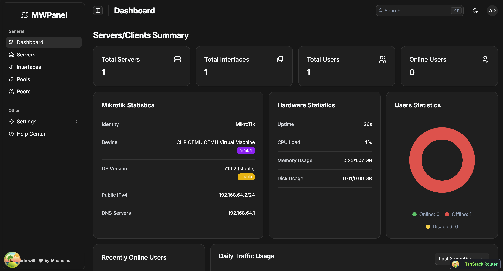
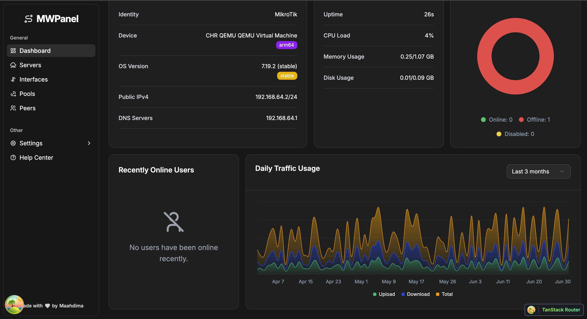
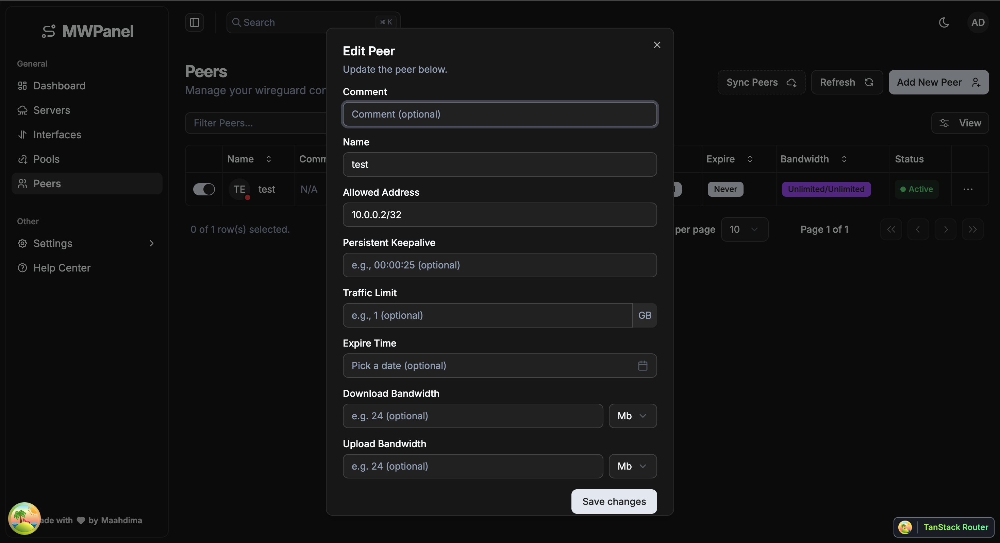
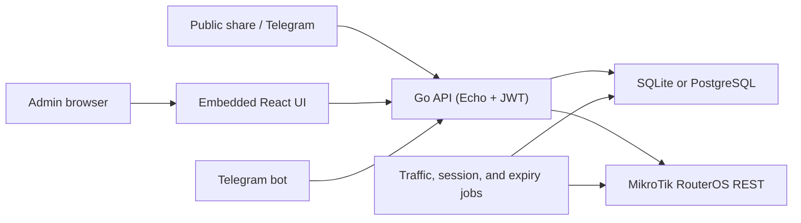

# MWP — MikroTik WireGuard Panel

A self-hosted admin panel for MikroTik WireGuard. Create peers, enforce traffic and bandwidth limits, share configs with QR codes, and watch usage in real time — from a single binary that embeds both the Go API and the React UI.

[](https://github.com/Maahdima/MWPanel/releases/latest)
[](https://hub.docker.com/r/maahdima/mwp)
[](https://go.dev/)
[](https://react.dev/)

---

## Table of contents

- [Highlights](#highlights)
- [Screenshots](#screenshots)
- [How it works](#how-it-works)
- [Requirements](#requirements)
- [Getting started](#getting-started)
  - [Binary releases](#binary-releases)
  - [Docker](#docker)
  - [Docker Compose](#docker-compose)
- [Build from source](#build-from-source)
- [Configuration](#configuration)
- [Usage](#usage)
- [Telegram bot](#telegram-bot)
- [TLS and reverse proxies](#tls-and-reverse-proxies)
- [Data and persistence](#data-and-persistence)
- [Background jobs](#background-jobs)
- [API overview](#api-overview)
- [Project structure](#project-structure)
- [Security](#security)
- [Troubleshooting](#troubleshooting)
- [Roadmap](#roadmap)
- [Contributing](#contributing)
- [Contact](#contact)

---

## Highlights

- **Peer lifecycle** — create, update, disable, and delete WireGuard peers on MikroTik
- **Keys and configs** — generate key pairs, download `.conf` files, and share via QR code or a time-limited public link
- **Limits that stick** — per-peer TTL, traffic caps, and upload/download bandwidth (simple queues)
- **Live operations** — last handshake, online status, usage totals, daily traffic charts, and device resources
- **Session history** — connect/disconnect timeline with duration and per-session usage
- **IP pools and interfaces** — manage WireGuard interfaces and address pools from the panel, or sync existing ones from the router
- **Telegram bot** — users link with their config UUID, then download configs, show QR codes, check usage, and opt into 80 / 90 / 100% traffic alerts
- **Excel export** — export peer traffic data from the admin panel
- **Single binary** — production UI is embedded in the Go binary; SQLite works out of the box
- **JWT auth** — access and refresh tokens; default admin is seeded only on first run

---

## Screenshots

### Dashboard





### Peers


### Create peer



### Share config


---

## How it works

MWP talks to MikroTik over the **RouterOS REST API** (`/rest`). The panel stores its own state (admins, servers, peers, sessions, usage) in SQLite or PostgreSQL, and writes WireGuard peers, schedulers, and simple queues onto the router.


```mermaid
flowchart LR
  Admin["Admin browser"] --> UI["Embedded React UI"]
  Share["Public share / Telegram"] --> API["Go API (Echo + JWT)"]
  UI --> API
  API --> DB["SQLite or PostgreSQL"]
  API --> MT["MikroTik RouterOS REST"]
  Jobs["Traffic, session, and expiry jobs"] --> MT
  Jobs --> DB
  Bot["Telegram bot"] --> API
```

Typical first-run path:

1. Start MWP and sign in with the panel admin account
2. Add a MikroTik server (IP, REST port, credentials)
3. Create a WireGuard interface or sync one from the router
4. Attach an IP pool
5. Create peers, then share configs via QR, link, or Telegram

---

## Requirements

| Component | Notes |
| --- | --- |
| **MikroTik RouterOS 7+** | REST API must be enabled (`/ip/service` → `www` or `www-ssl`). The panel user needs rights to manage WireGuard, simple queues, and schedulers. |
| **Network path** | MWP must reach the router on the REST port (commonly `80` or `443`). |
| **Runtime** | A binary, Docker, or Go 1.24+ if you build from source. |

No PostgreSQL is required for a default install. SQLite is created automatically under the data directory.

---

## Getting started

> [!TIP]
> The web panel listens on **port `3000`** by default. Open `http://localhost:3000` (or `http://localhost:3000{ADMIN_PANEL_PATH}/sign-in` if you set a custom panel path).

> [!CAUTION]
> Default admin credentials are **`mwpadmin` / `mwpadmin`**. Change them immediately.

> [!IMPORTANT]
> `ADMIN_USERNAME` and `ADMIN_PASSWORD` are used **only on the first run**, when the admin row is seeded. After that, change the account from **Settings → Account**. Setting the env vars later will not update an existing admin. Optional TOTP 2FA is configured under **Settings → Security**.

### Binary releases

Download the latest build for your platform from [Releases](https://github.com/Maahdima/MWPanel/releases/latest).

#### Linux

```bash
curl -fSLo mwp "https://github.com/Maahdima/MWPanel/releases/latest/download/mwp.linux.$(uname -m)"
sudo install -v -o root -g root -m 755 mwp /usr/local/bin/mwp
rm -f mwp
mwp
```

#### macOS

```bash
curl -fSLo mwp "https://github.com/Maahdima/MWPanel/releases/latest/download/mwp.darwin.$(uname -m)"
sudo install -v -o root -g root -m 755 mwp /usr/local/bin/mwp
rm -f mwp
mwp
```

#### Windows

Download the executable from [Releases](https://github.com/Maahdima/MWPanel/releases/latest) and run it:

```powershell
.\mwp.windows.amd64.exe
```

ARM64 builds are published as `mwp.windows.arm64.exe`.

Open `http://localhost:3000` after the process starts.

### Docker

```bash
docker run -d \
  --name mwp \
  --restart unless-stopped \
  -p 3000:3000 \
  -v mwp-data:/var/www/mwp \
  -e ADMIN_USERNAME=mwpadmin \
  -e ADMIN_PASSWORD=mwpadmin \
  maahdima/mwp:latest
```

If Docker Hub is unreachable, pull from GHCR instead:

```bash
docker pull ghcr.io/maahdima/mwp:latest
```

and use `ghcr.io/maahdima/mwp:latest` as the image name.

Images are published for `linux/amd64`, `linux/arm64`, and `linux/arm/v7`.

### Docker Compose

```yaml
services:
  mwp:
    image: maahdima/mwp:latest
    container_name: mwp
    restart: unless-stopped
    ports:
      - "3000:3000"
    environment:
      ADMIN_USERNAME: mwpadmin
      ADMIN_PASSWORD: change-me
      # TELEGRAM_BOT_ENABLED: "true"
      # TELEGRAM_BOT_TOKEN: "123456:ABC-DEF"
    volumes:
      - mwp-data:/var/www/mwp

volumes:
  mwp-data:
```

```bash
docker compose up -d
```

---

## Build from source

### Prerequisites

- **Go** 1.24 or later
- **Node.js** 18 or later
- **pnpm** (or npm)
- A MikroTik device with REST API access

### Development

Run the API and Vite UI as two processes:

```bash
git clone https://github.com/Maahdima/MWPanel.git
cd MWPanel

cp api/config/.env.example api/config/.env
# Edit api/config/.env — at least ADMIN_* and, if you use Postgres, DB_*

# From the repo root
go mod tidy

# Terminal 1 — API (loads api/config/.env by default)
cd api
go run ./cmd/main.go
```

```bash
# Terminal 2 — UI
cd ui
cp .env.example .env
# Required in split-process dev:
# VITE_API_BASE_URL=http://127.0.0.1:3000/api
pnpm install
pnpm run dev
```

The API serves JSON (and, in production builds, the UI) on port `3000`. In development the Vite app is a separate origin, so set `VITE_API_BASE_URL` to the API.

### Production binary (embedded UI)

The Go binary embeds `ui/dist` via `go:embed`. Build the frontend first:

```bash
cd ui
pnpm install
pnpm run build

cd ..
CGO_ENABLED=0 go build -trimpath -ldflags='-s -w' -o mwp ./api/cmd/main.go
./mwp
```

Visit `http://localhost:3000`.

---

## Configuration

MWP is configured with environment variables.

| Context | Where to put them |
| --- | --- |
| Binary / source | `api/config/.env`, or any file pointed to by `ENV_FILE` |
| Docker | `-e` flags or Compose `environment` |

Unset variables fall back to the defaults below. `ADMIN_*` only apply when the database has no admin yet.

### Server

| Variable | Description | Default |
| --- | --- | --- |
| `MODE` | `development` or `production`. Development enables debug logs and verbose GORM output. | `production` |
| `SERVER_HOST` | Bind address | `0.0.0.0` |
| `SERVER_PORT` | Listen port. `443` or `8443` enables AutoTLS. | `3000` |
| `DATA_DIR` | Data directory (SQLite file, AutoTLS cache, peer files). | OS user config dir + `/mwp` |
| `PEER_FILES_DIR` | Generated WireGuard config and QR files | `$DATA_DIR/peer-files` |
| `ENV_FILE` | Path to a dotenv file | `config/.env` |
| `CONSOLE_LOG_FORMAT` | `plain` or `json` | `plain` |

### Database

| Variable | Description | Default |
| --- | --- | --- |
| `DB_DIALECT` | `sqlite` or `postgres` | `sqlite` |
| `DB_NAME` | Database name (Postgres) or file path (SQLite) | SQLite: `$DATA_DIR/mwp.db` · Postgres: `mwp_db` |
| `DB_HOST` | Postgres host | `127.0.0.1` |
| `DB_PORT` | Postgres port | `5432` |
| `DB_USERNAME` | Postgres user | `root` |
| `DB_PASSWORD` | Postgres password | `1234` |

### Auth

| Variable | Description | Default |
| --- | --- | --- |
| `ADMIN_USERNAME` | Seeded admin username (first run only) | `mwpadmin` |
| `ADMIN_PASSWORD` | Seeded admin password (first run only) | `mwpadmin` |
| `ADMIN_PANEL_PATH` | Obscure admin UI path (e.g. `/my-panel`). Empty keeps admin at `/`. Public share links stay at `/share`. Restart required after change. | _(empty)_ |
| `AUTH_ACCESS_TOKEN_TTL` | Access token lifetime, seconds | `900` |
| `AUTH_REFRESH_TOKEN_TTL` | Refresh token lifetime, seconds | `86400` |

### Jobs

| Variable | Description | Default |
| --- | --- | --- |
| `TRAFFIC_JOB_INTERVAL` | How often to poll peer counters, expire overdue peers, and evaluate traffic alerts (seconds) | `300` |
| `SESSION_JOB_INTERVAL` | How often to poll handshakes for session history (seconds) | `30` |

### Telegram

| Variable | Description | Default |
| --- | --- | --- |
| `TELEGRAM_BOT_ENABLED` | `true` / `false` | `false` |
| `TELEGRAM_BOT_TOKEN` | Token from [@BotFather](https://t.me/BotFather) | empty |
| `TELEGRAM_BOT_API_BASE_URL` | Bot API base URL (override for local Bot API servers) | `https://api.telegram.org` |

---

## Usage

1. **Sign in** at `http://localhost:3000` (or `http://localhost:3000{ADMIN_PANEL_PATH}/sign-in`) with the panel admin (not the MikroTik user).
2. **Add a server** under **Servers** — router IP, REST port, username, and password. MWP verifies the connection against `/rest/system/identity`.
3. **Interfaces** — create a WireGuard interface or **sync** ones that already exist on the router.
4. **Pools** — define the IPv4 range used when allocating peer addresses.
5. **Create a peer** — name, interface, keys, allowed address, optional expiry, traffic cap, and bandwidth.
6. **Share** — enable sharing, then send the public link, QR code, or config UUID. Share links can expire independently of the peer.
7. **Monitor** — dashboard for device resources and traffic; peer list for online status and usage; session dialog for connect/disconnect history.
8. **Reset or revoke** — reset usage, disable the peer, or delete it (removes the MikroTik peer, queue, and scheduler).

MikroTik credentials are stored on the **server** record. They are never the same as the panel login.

---

## Telegram bot

Enable the bot and set a token, then restart MWP.

Users:

1. Copy the peer’s config UUID from the share dialog
2. Open the bot and send `/start`, then the UUID
3. Optionally save a Telegram username so alerts still find them

| Command | What it does |
| --- | --- |
| `/start` | Link this chat to a config UUID |
| `/menu` | Action menu for the linked peer |
| `/details` | Usage, status, and expiry |
| `/config` | Download the WireGuard file |
| `/qrcode` | Show the QR code |
| `/notify` | Toggle 80 / 90 / 100% traffic alerts |
| `/unlink` | Disconnect this chat |
| `/help` | Short usage guide |

Alerts fire when usage crosses 80%, 90%, and 100% of the peer’s traffic limit. At 100% the peer is treated as exhausted by the traffic job.

The bot uses long polling. Do not set a webhook on the same bot token.

---

## TLS and reverse proxies

If `SERVER_PORT` is `443` or `8443`, MWP starts Echo AutoTLS and stores certificates under `DATA_DIR`.

For a reverse proxy (Caddy, Nginx, Traefik), terminate TLS there and proxy to `http://127.0.0.1:3000`. Forward `Host` and WebSocket-unrelated headers as you would for any SPA + JSON API. The UI and `/api` are served from the same origin in production, so no CORS setup is required behind a single hostname.

---

## Data and persistence

| Path | Purpose |
| --- | --- |
| `$DATA_DIR/mwp.db` | SQLite database (default dialect) |
| `$DATA_DIR/peer-files` | Generated configs and QR images |
| `$DATA_DIR` | AutoTLS certificate cache when using ports 443 / 8443 |

Docker should keep `/var/www/mwp` on a named volume so the database and peer files survive recreates.

Schema updates run automatically with GORM `AutoMigrate` on startup.

---

## Background jobs

| Job | Interval | Role |
| --- | --- | --- |
| Peer traffic | `TRAFFIC_JOB_INTERVAL` | Read MikroTik counters, accumulate usage, send Telegram thresholds |
| Expire overdue peers | `TRAFFIC_JOB_INTERVAL` (runs immediately on start) | Disable peers that hit TTL or traffic cap |
| Session tracking | `SESSION_JOB_INTERVAL` (runs immediately on start) | Infer connect/disconnect from handshake freshness |
| Daily traffic | midnight | Snapshot interface traffic for dashboard charts |

Peers are considered online when the last handshake is newer than **150 seconds**.

---

## API overview

The HTTP API is served under `/api`. Admin routes require a Bearer JWT from `POST /api/auth/login`. Public share routes are unauthenticated and keyed by peer UUID.

| Prefix | Auth | Purpose |
| --- | --- | --- |
| `/api/auth` | Login / 2FA verify public; profile & TOTP JWT | Sign-in, optional TOTP 2FA, admin profile |
| `/api/server` | JWT | MikroTik server CRUD |
| `/api/interface` | JWT + live router | WireGuard interfaces |
| `/api/ip-pool` | JWT | Address pools |
| `/api/peer` | JWT (+ live router for mutations) | Peers, share, QR, sessions, traffic export |
| `/api/device` | JWT + live router | Device stats and daily traffic |
| `/api/sync` | JWT + live router | Import existing interfaces and peers |
| `/api/user/:uuid/*` | Public | Shared config, QR, details, Telegram status |
| `/api/telegram/status` | Public | Whether the bot is enabled |

Mutations that talk to the router return `503` if MWP cannot reach MikroTik.

---

## Project structure

```text
MWPanel/
├── api/
│   ├── cmd/main.go          # Entry point, scheduler, HTTP server
│   ├── cmd/http-server/     # Echo setup, AutoTLS
│   ├── cmd/jobs/            # Traffic, sessions, expiry
│   ├── adaptor/mikrotik/    # RouterOS REST client
│   ├── config/              # Env loading
│   ├── dataservice/         # GORM models, migrations, seeds
│   ├── http/                # Controllers and /api routes
│   └── service/             # Peers, Telegram, QR, sync, …
├── ui/                      # React 19 + Vite + TanStack Router
│   └── assets.go            # go:embed dist/*
├── docker/Dockerfile
└── README.md
```

Stack: **Go (Echo, GORM, Zap, JWT)** · **React 19, TypeScript, Vite, Tailwind, TanStack Query/Router**.

---

## Security

- Change the default admin password before exposing the panel.
- Give MikroTik a dedicated user with only the rights MWP needs; do not reuse the full `admin` account if you can avoid it.
- Prefer HTTPS to the panel (`443` / `8443`, or a reverse proxy) and HTTPS (`www-ssl`) to the router when the path is untrusted.
- Optionally set `ADMIN_PANEL_PATH` (e.g. `/my-panel`) so the admin UI is not at `/` or `/sign-in`. Bookmark `https://your-host/my-panel/sign-in`. Public share URLs stay at `/share`.
- Treat share links as secrets. Disable sharing or set a share expiry when a config should no longer be public.
- `ADMIN_*` env vars are not a password-reset mechanism. Use the account settings page.
- Keep MWP and RouterOS updated; REST access to the router is equivalent to control of WireGuard on that device.

---

## Troubleshooting

**Cannot sign in after changing `ADMIN_PASSWORD` in env**  
The seed runs only when no admin exists. Change the password in the UI, or (last resort) clear the admin table / SQLite file if this is a disposable install.

**`Client is not connected to the server` (HTTP 503)**  
No reachable MikroTik is configured, the REST service is off, the port/IP is wrong, or credentials failed. Confirm `/rest/system/identity` from the MWP host.

**Peers exist on the router but not in the panel**  
Use **Sync** on the Interfaces and Peers pages to import selected items.

**Telegram never starts**  
`TELEGRAM_BOT_ENABLED` must be a truthy value (`true`, `1`, `yes`) and `TELEGRAM_BOT_TOKEN` must be set. Check logs for bot identity on startup.

**SQLite file disappeared after a Docker recreate**  
The container must mount `/var/www/mwp`. Without a volume, the database lives only in the writable layer.

**UI is empty in a source build**  
Production embeds `ui/dist`. Run `pnpm run build` in `ui/` before `go build`, or use Vite in development.

---

## Roadmap

- [x] MikroTik WireGuard peer management
- [x] QR code and link sharing
- [x] TTL and traffic expiration
- [x] Stats dashboard (handshake, usage, device resources)
- [x] Import / sync from the router
- [x] JWT authentication
- [x] Admin TOTP two-factor authentication (authenticator app + recovery codes)
- [x] Light / dark theme
- [x] Docker images (amd64, arm64, armv7)
- [x] Single-binary releases
- [x] Telegram bot (configs, QR, usage, alerts)
- [x] Peer session history
- [x] Bandwidth limits via simple queues
- [ ] Concurrent multi-router operation (server CRUD exists; request routing is still single-router)

---

## Contributing

Bug reports and pull requests are welcome.

1. Fork the repository
2. Create a branch: `git checkout -b feat/my-feature`
3. Keep changes focused; match the surrounding Go / TypeScript style
4. Open a pull request against `main`

For larger features, open an issue first so the approach can be discussed.

---

## Contact

Maintained by [Maahdima](https://github.com/Maahdima). Use [GitHub Issues](https://github.com/Maahdima/MWPanel/issues) for bugs and questions.
